# Employee Management System

A desktop-based Employee Management System built with Python, CustomTkinter, and MySQL.

The application provides a graphical interface for managing employee records, authentication, database operations, employee analytics, data export, backup and restoration, and AI-powered read-only database analysis using Ollama.

---

## Features

### 🔐 User Authentication

| Login | Change Password |
|---|---|
| 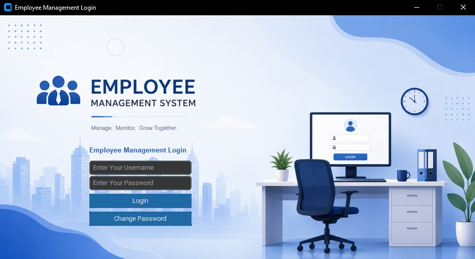 | 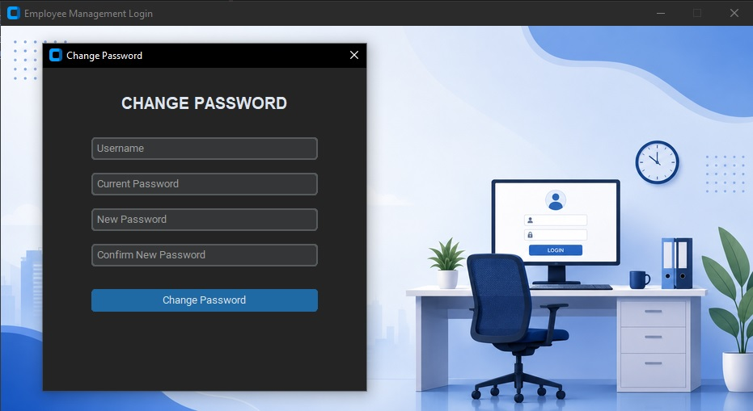 |

- Login system with username and password
- Password hashing using SHA-256
- Change password functionality
- Login validation and error handling
- Logout functionality

### 👨‍💼 Employee Management

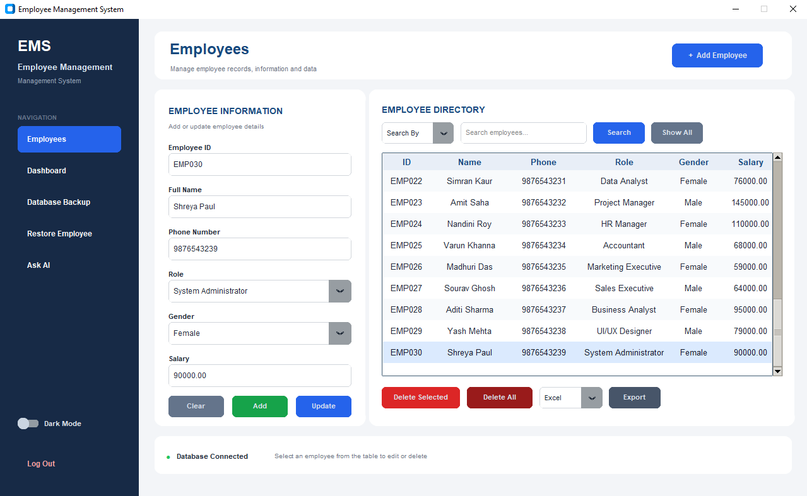

- Add new employees
- Update employee information
- Delete individual employees
- Delete all employees
- Search employees
- Display all employees
- Input validation for:
  - Employee ID
  - Phone number
  - Salary
  - Employee information

### 🔄 Employee Restore

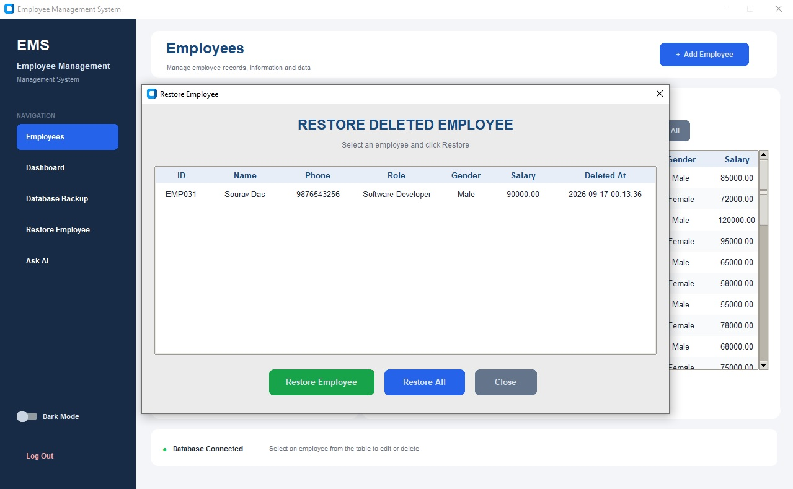

- Deleted employees are moved to a separate database table
- View deleted employee records
- Restore individual employees
- Restore all deleted employees
- Track when an employee was deleted

### 📊 Employee Dashboard 

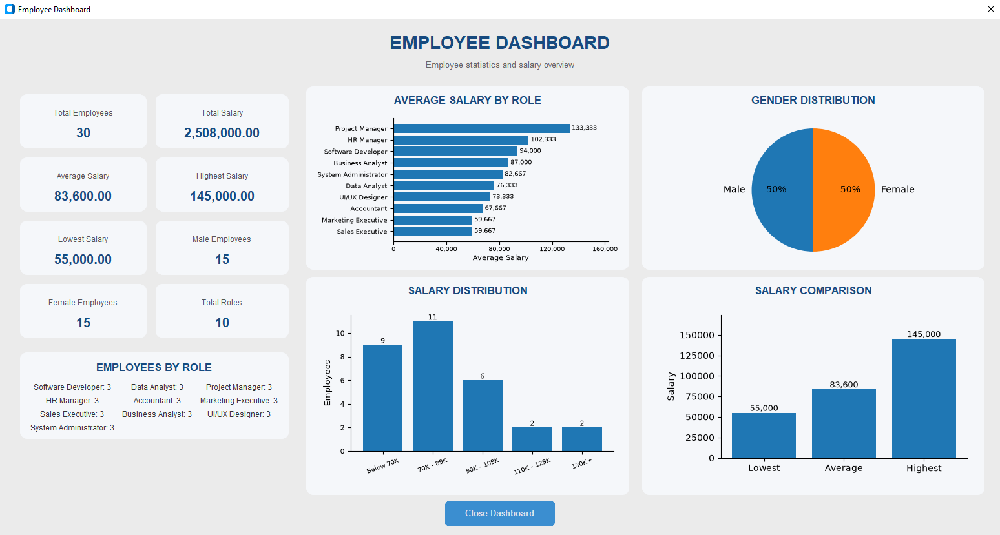

Interactive dashboard containing:

- Total employees
- Total salary
- Average salary
- Highest salary
- Lowest salary
- Male employee count
- Female employee count
- Total number of roles
- Employees by role
- Average salary by role
- Gender distribution
- Salary distribution
- Salary comparison

Charts are created using Matplotlib.

### 🔎 Employee Search

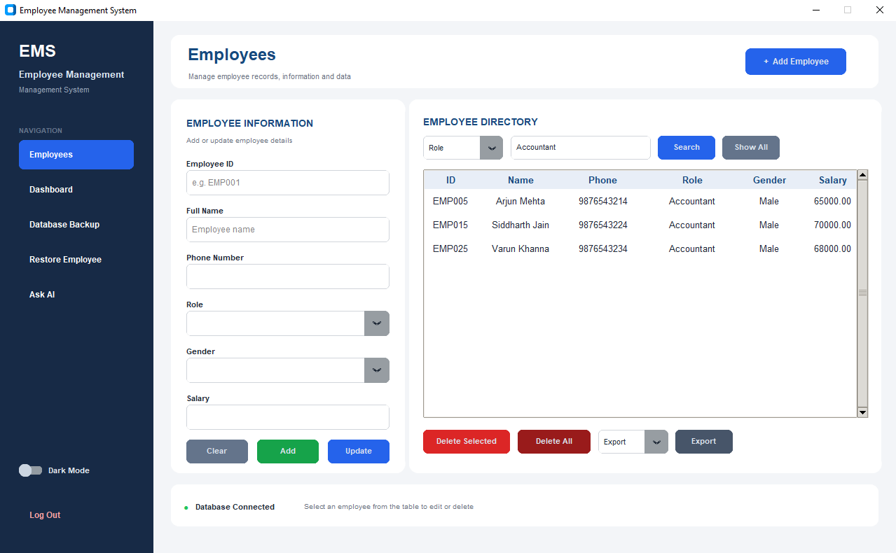

Search employee records based on fields such as:

- Employee ID
- Name
- Phone
- Role
- Gender
- Salary

### 📁 Data Export

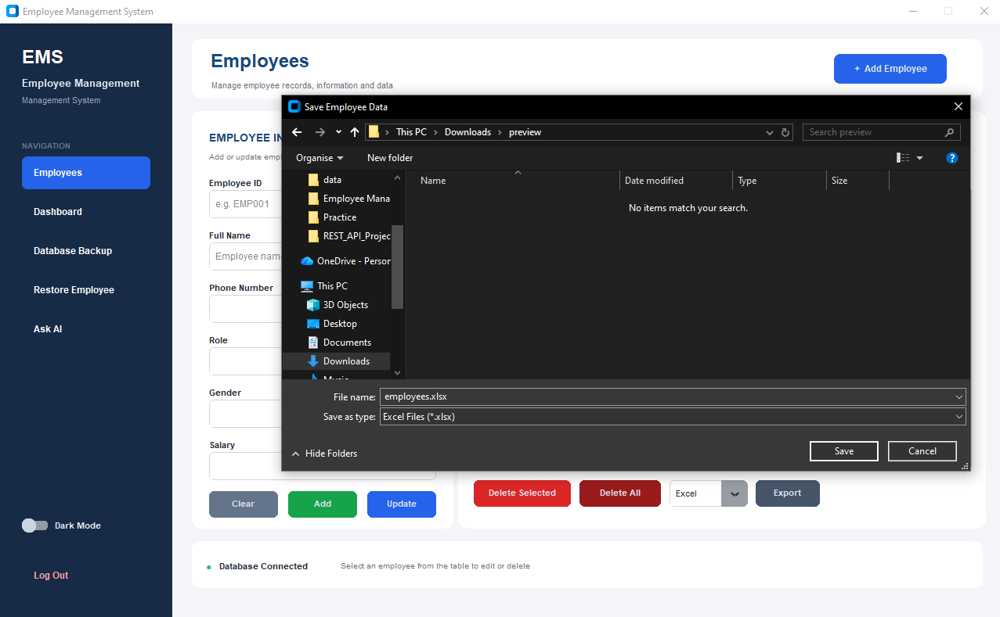

Export employee records to:

- CSV
- Excel (`.xlsx`)

### 💾 Database Backup

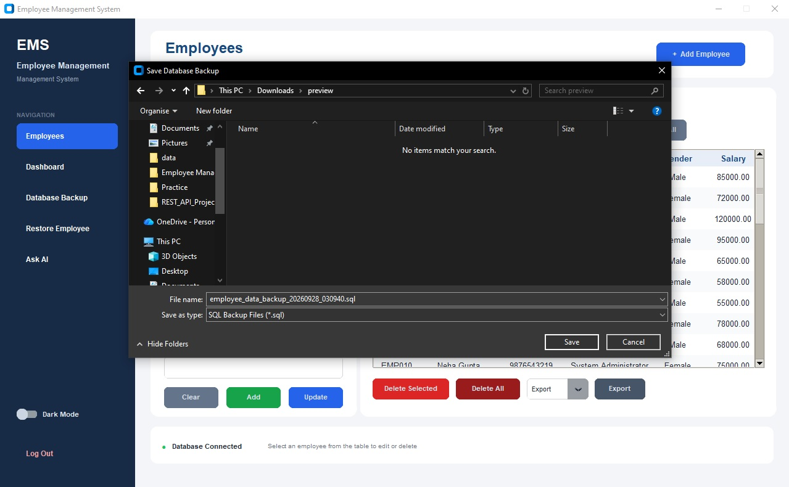

Create SQL database backups from the application using a save dialog.

### 🤖 Ask AI About Your Database

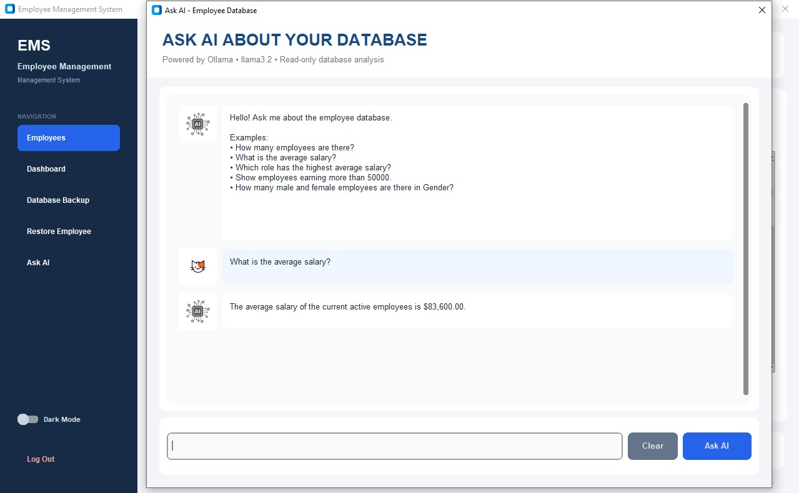

The application includes an AI-powered database assistant using:

**Ollama + Llama 3.2**

You can ask natural-language questions such as:

- How many employees are there?
- What is the average salary?
- Which role has the highest average salary?
- Show employees earning more than 50000.
- How many male and female employees are there?

The AI converts natural-language questions into SQL, executes the query against MySQL, and converts the result back into a natural-language response.

The AI assistant is designed as a **read-only database analysis tool** and only allows `SELECT` queries.

### 🌓 Light & Dark Mode

| Light Mode | Dark Mode |
|---|---|
| 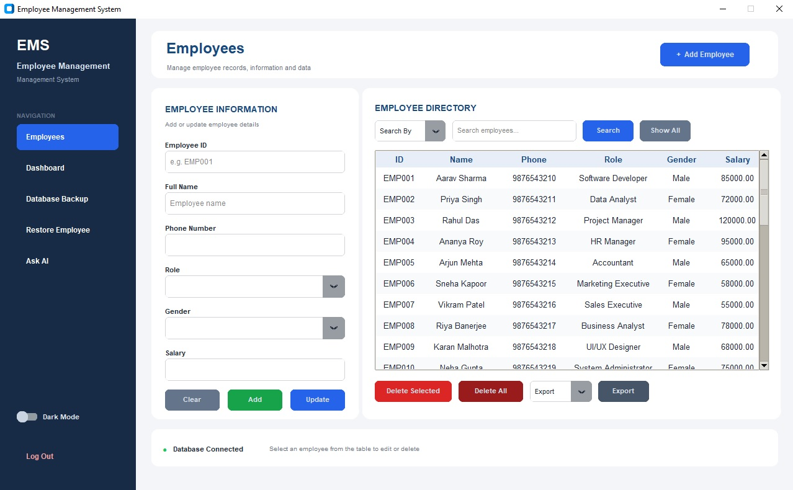 | 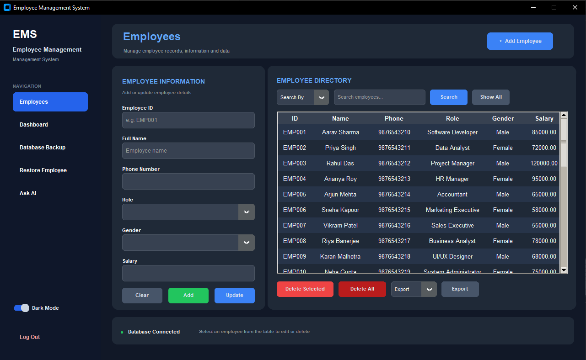 |

The application supports:

- Light mode
- Dark mode

The interface dynamically changes between the two themes.

---

## Tech Stack

| Technology | Purpose |
|------------|---------|
| Python | Application development |
| CustomTkinter | Modern desktop GUI |
| Tkinter | GUI components and dialogs |
| MySQL | Database management |
| PyMySQL | Python-MySQL connectivity |
| Matplotlib | Dashboard charts |
| OpenPyXL | Excel export |
| Pillow | Image handling |
| Ollama | Local AI integration |
| Llama 3.2 | AI database assistant |

---

## Project Structure

```text
Employee-Management-System/
│
├── images/
│   ├── ai_logo.jpg
│   └── cat_logo.jpg
│
├── askAI.py
├── dashboard.py
├── database.py
├── ems.py
├── login.py
│
├── login_image.png
├── emp_background.jpg
├── employee_backup.sql
│
├── requirements.txt
├── README.md
└── .gitignore
